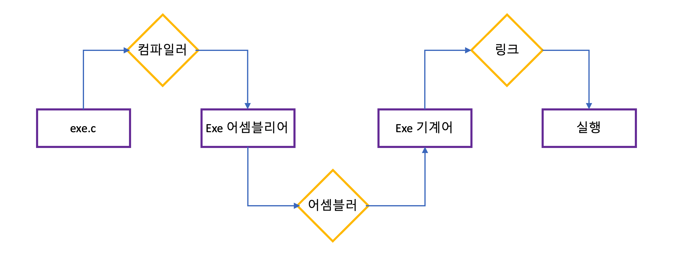
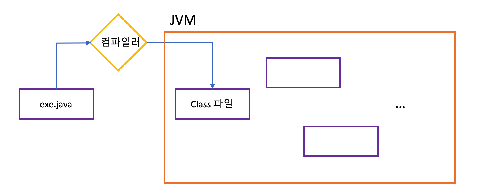

# Java 컴파일 과정과 방법

자바의 컴파일 과정 및 방법에 대한 글입니다. 자바 코드가 어떻게 실행되는지 어떻게 실행하는지에 대해 설명해 보겠습니다.

### 목차

1. 컴파일
2. 자바 컴파일 과정
3. 바이트 코드

## 컴파일?

컴파일이 무엇일까요? 바로 사람이 이해하는 언어를 컴퓨터가 이해할 수 있는 언어로 바꿔주는 과정이라 보면 됩니다. 먼저 씨언어의 컴파일 과정을 볼까요?

* C언어의 컴파일 과정

씨언어는 다음과 같은 구조로 컴파일을 진행합니다. C 파일을 컴파일을 통해 어셈블리어를 만들거 어셈블러를 통해 기계어를 만들어 실행 시킵니다. 그럼 자바는 어떻게 하는지 살펴 볼까요?

* Java의 컴파일 과정

자바 컴파일러는 자바 파일을 클래스 파일로 변환시킨뒤 JVM에 의해 실행됩니다. 자세한 내용은 나중에 JVM을 공부할 때 더 알아 보도록 하겠습니다.

## Java Compile 과정

그럼 자바 컴파일에서 어떤 과정을 거칠까요? 다음 4가지 과정을 거쳐 컴파일 됩니다.

> 1. 어휘  분석
> 2. 구문 분석
> 3. 의미 분석
> 4. 바이트코드화

다음과 같은 과정이 일어나는데 한번 하나씩 살펴보겠습니다.

### 1. 어휘 분석 단계

어휘 분석 단계에서는 키워드, 리터럴, 오퍼레이터 즉 어휘소를 수집합니다. 예를 들어 키워드는 ``public``, 리터럴은 ``"Hello World"``, 오퍼레이터는 ``+`` 등이 있습니다. 

이렇게 어휘소를 수집하면 하나의 스트림 형태로 만들어주는데 이를 토큰 스트림이라 합니다.

### 2. 구문 분석 단계

구문 분석 단계는 무엇을 진행할까요? 바로 어휘 분석 단계에서 나온 토큰 스트림을 가지고 문법에 맞는지 확인합니다. 여기서 에러가 발생하면 바로 우리가 잘 아는 ``Syntax Error``가 발생합니다.

### 3. 의미 분석 단계

의미 분석 단계에는 말 그대로 의미가 맞는지 검사합니다. 예를 들어 타입 검사, 자동 타입 변환 같은걸 진행하고 의미가 맞지 않은 원시 타입을 입력했을 경우 여기서 에러가 발생하게 됩니다.

### 4. 바이트코드

의미 분석 단계까지 끝났으면 말그대로 바이트코드를 생성하고 최적화 시킵니다.

## 바이트코드?

바이트코드가 뭘까요? 바이트코드... 많이 들어본 말같은데 과연 무엇일까요? 위키에서는 다음과 같이 정의합니다.

> 바이트코드는 특정 하드웨어가 아닌 가상 컴퓨터에서 돌아가는 실행 프로그램을 위한 이진 표현법이다.

이 말을 자바로 빗대어 표현하면 다음과 같습니다.

> 바이트코드는 컴퓨터가 아닌 JVM에서 돌아가는 실행 프로그램을 위한 이진 표현법이다.

즉 바이트 코드란 JVM이 읽을 수 있는 언어라 생각하면 될 것 같습니다. 즉 바이트코드는 프로그램 분석하고 클래스 파일 생성 등 JVM이 읽을 수 있는 언어로 변환시켜 줍니다.

또한 JVM위에서 돌아가는 모든 언어는 바이트코드로 변환되기 때문에, 여러개의 언어를 동시에 사용할 수 있습니다. 즉 java, scala, kotlin, jruby 등 이 언어들을 하나의 프로젝트에서 별다른 설정 없이 사용 가능합니다.

