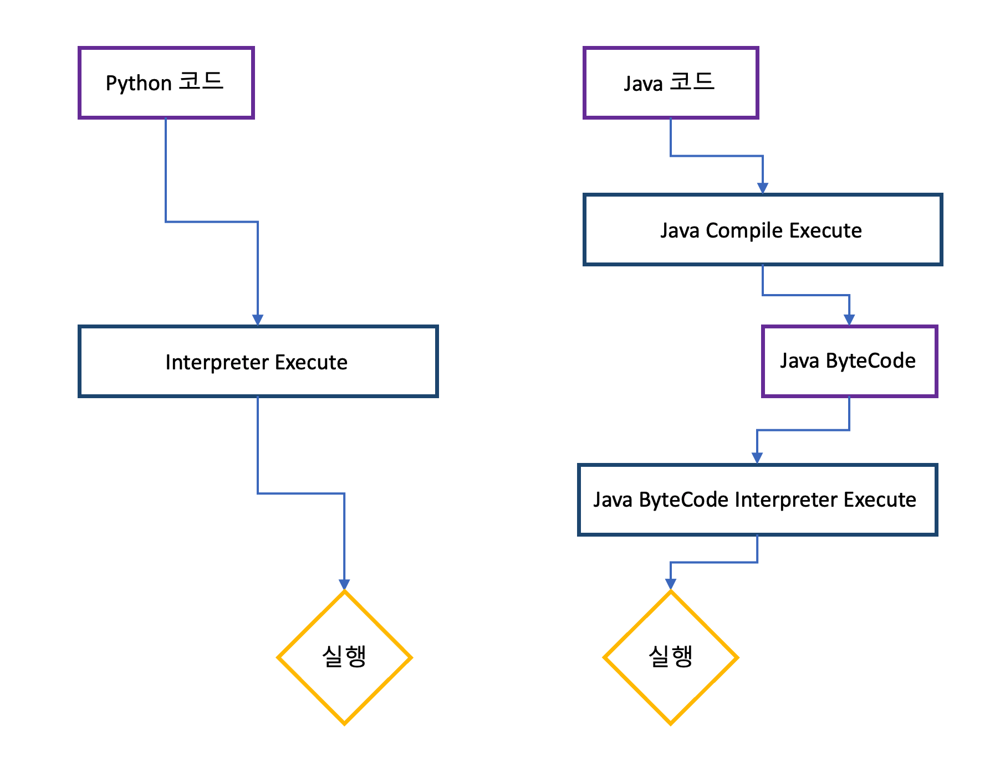

# Java 런타임에 대하여

이번 글에서는 JVM이 무엇인지 어떤 역할을 하는지 JVM내에 어떤 일이 일어나는지 등 알아보려고 합니다.

### 목차

1. 런타임?
2. JVM
   1. 스택기반 vs 레지스터기반
   2. JIT
   3. JVM 구조
3. JDK, JRE

## 런타임?

런타임이란 말 글대로 프로그램에서 실행되고 있는 동안의 동작을 말합니다. 자바에서 런타임은 어떤 과정으로 이루어져 있을까요? 아래 순서를 적어봤습니다.

> 1. JDK를 통해 바이트코드를  생성합니다.
> 2. 생성된 바이트코드를 JRE에 넘겨줍니다.
> 3. JRE를 사용해서 바이트코드를 JAVA 명령어로 실행하라고 합니다.
> 4. 그러면 JVM이 실행 시킵니다.

이런 과정으로 자바 파일이 실행되어 집니다. 그럼 이제부터 본격적으로 궁금한 키워드 JDK, JRE, JVM이 무엇인지 공부해  봅시다.

## JVM

Java는 스택 기반 가상 머신으로 특정 OS에 독립적이라고 많이 말합니다. 그 이유는 JVM이 내부에서 특정 OS에 맞게 자바 언어를 Interpreter나 JIT를 가지고 기계어로 변환시켜주기 때문입니다. 이 말은 JVM이 특정 OS에 종속된다는 뜻입니다. 하지만 JAVA는 JVM 때문에, 위와 같이 독립적인 성향을 가집니다.

여기서 궁금한 점! 스택 기반은 무엇이고, JIT, Interpreter들은 무엇일까요?

### 가상 머신의 종류 : 스택 기반? 레지스터 기반?

* 스택 기반
  * 스택기반은 스택을 이용해 연산을 하는 방법입니다. 피연산자를 POP하고 연산해 PUSH하는 구조로 이루어져 있습니다. 
  * PUSH, POP을 이용한 연산이기 때문에 메모리가 따로 필요없다는 장점을 가지고 있습니다.
  * 스택을 이용하기 때문에 레지스터 기반보다 느리다는 단점을 가지고 있습니다.
* 레지스터 기반
  * 레지스터 기반은 주소를 이용해 연산을 하는 방법입니다. CPU 레지스터에 저장시키고 주소를 가지고와 연산하는 방식입니다.
  * 주소만 가지고 연산하는 방식이기 때문에 스택 기반보다 빠르다는 장점이 있습니다.
  * 하지만 주소를 저장해야하기 때문에 메모리 확보와 주소를 명시해야 하는 단점이 있습니다.

### JIT

JIT는 Just-In-Time의 약자로 JVM에서 기계어를 실행시키는 방법중에 하나입니다. 즉 JVM은 Interpreter와 JIT를 같이 사용하고 있습니다. 그럼 왜  JIT가 나왔을까요?

* 인터프리터 언어 vs 컴파일 언어

이 그림은 파이썬과 자바의 동작 과정을 그림으로 표현한 도식화입니다. 이 둘의 차이점은 무엇일까요? 바로 파이썬은 인터프리트 방식을 한번만 거치고 자바는 컴파일과 인터프리터 방식 둘다 거칩니다. 여기서 ``컴파일 방식``은 ``소스코드를 한꺼번에 기계어``로 변환하는 방식이고 ``인터프리터 방식``은 ``런타임시에 한줄씩 읽어 기계어로 변환``하는 것을 말합니다.

그렇다면 이 둘의 속도는 어떤것이 더 빠를까요? 

> 파이썬은 인터프리터 방식을 한번만 거치고 자바는 컴파일과 인터프리터를 둘다 거치기 때문에 파이썬이 더 빠르다.

바로 이 과정 때문에 한때 자바는 느린 언어라는 낙인이 찍혔습니다. 따라서 자바는 이 낙인을 벗어나기 위해 이러한 생각을 하게  되었습니다.

> 이미 번역한 소스코드를 저장해 보면 어떨까?

이 방식이 바로 JIT 컴파일러 방식입니다. 정확히 말하면 컴파일 된 코드를 일정 부분 끊고 그 안에 중복이 있으면 저장소에서 꺼내와 기계어로 변환시켜주는 방식입니다. 저장소에서 가지고 온 코드는 다시 번역할 필요가 없기 때문에 속도가 빨라집니다. 이 방식 때문에 현재 자바는 다른 언어 성능에 크게 뒤쳐지지 않는다고 합니다.

### JVM의 구조

JVM의 구조는 어떻게 이루어져 있을까요? JVM은 크게 3가지로 이루어져 있다고 합니다.

> 1. 클래스 로더
> 2. JVM 메모리 (메소드 영역, 힙 영역, 스택 영역, PC 레지스터, 네이티브 메소드 스택)
> 3. 실행 엔진 (GC, JIT, Interpreter ...)

(출처 - [위키 백과](https://ko.wikipedia.org/wiki/%EC%9E%90%EB%B0%94_%EA%B0%80%EC%83%81_%EB%A8%B8%EC%8B%A0))

위에 그림과 같이 이러한 구조로 이루어 졌습니다. 그럼 하나씩 살펴 볼가요?

1. 클래스 로더

클래스 로더는 클래스를 읽어와 메모리 메소드에 배치시키는 역할을 합니다. ``로딩 -> 링크 -> 초기화`` 이러한 과정을 거치고 ``ClassNotFoundException`` 예외가 바로 클래스 로더 지점에서 발생되는 예외입니다.

2. JVM 메모리 영역 (RunTime Data Area)

메모리 영역은 다음과 같은 구조로 이루어져 있습니다.

* Thread 영역
  * PC Registers - 쓰레드가 어떤 부분을 어떤 명령어로 수행하는지에 대해 기록하는 영역입니다.
  * Native Method - 자바 외 언어를 수행시키기 위한 메모리 영역입니다.
  * JVM Stack - 쓰레드마다 스택을 만들어 프레임을 저장시킵니다. 즉 메소드 하나를 호출할 때마다 새 프레임이 생성되어 스택에  쌓이고, 메소드 호출이 완료되면 프레임은 스택에서 빠져나와 소멸됩니다. 또한 쓰레드가  종료되면 스택도 제거됩니다.
* Heap 영역 
  * 인스턴스화된 클래스의 배열이나 객체를 저장하는 공간입니다.
  *  이 공간의 들어있는 자원은 쓰레드의 공유 자원이고 힙에 할당된 메모리 회수 권한은 GC에 의해서만 회수가 가능합니다.
* Method 영역
  * 필드 정보, 메소드 정보, 타입 정보 등 클래스 수준의 정보를 저장하는 공간입니다.
  * 메소드 영역은 힙의 일부여서 GC 대상이 되지만 JVM을 만든 회사마다 다르기 때문에 힙 영역과 합쳐서 이야기를 하지 않는다고 합니다.

3. 실행 엔진

실행 엔진은 클래스 로딩 과정을 통해 런타임 데이터 영역에 배치된 바이트 코드를 명령어 단위로 읽어서 수행하는 구간입니다. 즉 여기서 JIT, Interpreter가 실행됩니다. 

> Q) JNI, 네이티브 메소드는 무엇일까요?
>
> * JNI는 네이티브 메소드 라이브러리르 호출할수 있는 방법을 제공합니다.
> * 네이티브 메소드 JVM에서 C, C++, 어셈블리어로 구축한 네이티브 함수를 말합니다.
>
> 예를 들어 ``native`` 키워드를 사용해서 네이티브 메소드로 작성할 수 있습니다.

## JDK, JRE

이제 JVM에 내부적인 구조와 동작을 공부했다면 JDK, JRE에 대해 알아보도록 하겠습니다.

### JDK란?

JDK는 Java Development Kit으로 자바 프로그램을 개발하고 필요한 툴들을 모은 소프트웨어 패키지입니다. 즉 자바 프로그램을 작성하고, JRE를 실행하는데 필요한 도구, java를 컴파일 시키는 Javac 등을 가지고 있습니다. 

### JRE란?

JRE는 자바 프로그램 동작시 필요한 환경을 제공해주는 패키지입니다. 즉 자바 프로그램을 구동시키기 위해 사용됩니다. JRE는 클래스 라이브러리, JVM, 여러 Supporting 파일들을 가지고 있습니다. 

### JDK vs JRE

그럼 이 둘의 차이점은 무엇일까요? 한번 표로 정리해봤습니다.

|| JDK                             | JRE                                                          |
| ------------------------------- | ------------------------------------------------------------ | ------------------------------- |
| 정의 | 개발자들을 위해 필요한 툴과 JRE를 합쳐 배포한 패키지 키트 |자바 어플리케이션을 실행시키기 위해 최소 단위로 배포한 패키지|
| 사용 용도 | 소스 코드를 작성하기 위해 사용                  |소스 코드를 읽기 위해 사용|
| 내부 구조 | JRE, JVM |JVM|
| 버전 지원 | 모든 버전 지원 |JAVA 11부터 지원 x|

